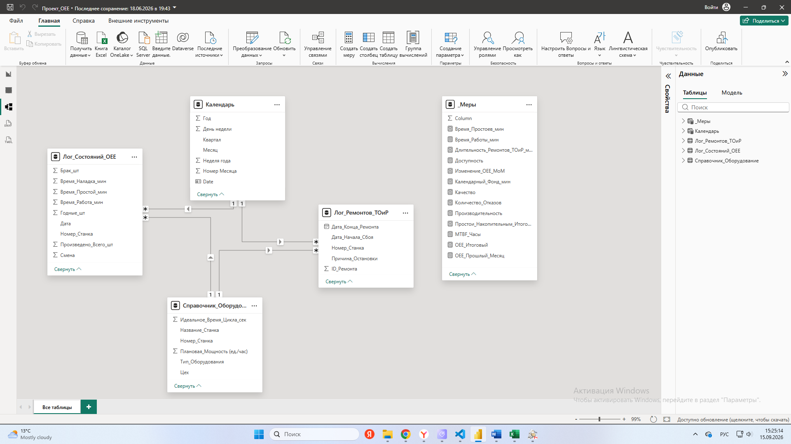

# 📊 Аналитическая BI-система мониторинга OEE и надежности оборудования (MTBF / ТОиР)

[](https://powerbi.microsoft.com/)
[](https://docs.microsoft.com/en-us/dax/)
[](#-архитектура-и-модель-данных)

## 📌 Бизнес-контекст и задачи проекта

Для операционного управления производственным комплексом требовался инструмент сквозного контроля эффективности и надежности активов. 

**Ключевая цель:** Перейти от разовой фиксации поломок к системному мониторингу общей эффективности оборудования (OEE - Overall Equipment Effectiveness), декомпозиции операционных потерь и оценке показателей инженерной надежности (MTBF).

---

## 🛠 Технический стек и архитектура решения

* **Инструменты:** Power BI Desktop, DAX, Power Query.
* **ETL-слой:** Очистка, связывание и подготовка сырых логов состояний и ремонтов.
* **Моделирование данных:** Построена модель данных **«Звезда» (Star Schema)**. Две таблицы фактов (`Лог_Состояний_OEE` и `Лог_Ремонтов_ТОиР`) сгруппированы вокруг справочников оборудования (`Справочник_Оборудование`) и центрального `Календаря`.
* **Аналитические вычисления (DAX):**
  * Использование итераторов `SUMX` для корректного расчета взвешенной производительности с учетом индивидуальных нормативов цикла.
  * Реализация Time Intelligence мер для расчета динамики MoM (`PREVIOUSMONTH`) и накопительного итога простоев YTD (`TOTALYTD`).



---

## 📊 Структура дашборда и ключевые выводы

Интерактивный отчет состоит из двух аналитических страниц:

### Страница 1: Мониторинг общей эффективности активов (OEE)


* **Текущий статус:** Средний показатель OEE по предприятию составляет **85,8%** (что соответствует нормативу World Class OEE > 85%).
* **Уязвимая зона:** Наименьшая эффективность зафиксирована у **конвейерных линий (OEE 81%)**. Покомпонентный анализ показал, что падение вызвано снижением **Производительности (89%)**, при этом Доступность (96%) и Качество (96%) находятся в норме.
* **Первопричина (Root Cause):** Структурный анализ причин простоев показал, что основным фактором является **механический износ узлов**. Чтобы предотвратить аварийные остановы, операторы вынуждены снижать рабочую скорость линий.

---

### Страница 2: Анализ отказов и инженерная надежность (MTBF)


* **Динамика простоев (YTD):** Накопительный итог времени простоев демонстрирует равномерный линейный рост в течение года, достигая **~33 тыс. минут к декабрю**, что говорит об отсутствии явной сезонности в авариях.
* **Частота инцидентов:** Наибольшее количество отказов приходится на **Линии (58 инцидентов)** и **Вулканизаторы (50 инцидентов)** — на них суммарно генерируется более 30% всех поломок.
* **Метрика MTBF:** Среднее время между отказами по заводу — **102,8 часа**. Самый низкий показатель надежности у **Линий (MTBF 63,6 ч)**, что указывает на необходимость их приоритетного вывода в планово-предупредительный ремонт (ППР). Наиболее стабильно функционирует контрольное оборудование (MTBF 946,7 ч).

---

## 🎯 Применимость решений в Supply Chain, логистике и ритейле (X5, Магнит, Деловые Линии)

Методология оценки OEE и MTBF легко адаптируется под задачи крупной логистики:
1. **Эффективность сортировочных центров (РЦ):** Контроль OEE автоматических сортеров и конвейеров позволяет выявлять скрытые потери производительности, предупреждая задержки при формировании и отгрузке заказов.
2. **Предиктивный ТОиР:** Мониторинг MTBF и динамики отказов позволяет переходить от дорогостоящего аварийного ремонта к обслуживанию по фактическому состоянию.

---

## 🚀 Инструкция по запуску
1. Клонируйте репозиторий:
   ```bash
   git clone [https://github.com/mgubina/oee-and-maintenance-analytics.git](https://github.com/mgubina/oee-and-maintenance-analytics.git)
2. Откройте файл model/OEE_and_Maintenance_Analytics_Dashboard.pbix в Power BI Desktop.
